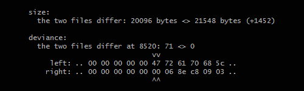
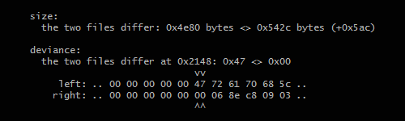

# binary-comparator

Compares two binary files and tells some info on where they differ

## installation

`npm i -g binary-comparator`

## usage

`bin-compare --version`

`bin-compare <file1> <file2>`

`bin-compare <file1> <file2> --hex`

`bin-compare <file1> <file2> --hex --skip=4`

## output in the console

### when two files differ

### when two files differ and --hex is set

